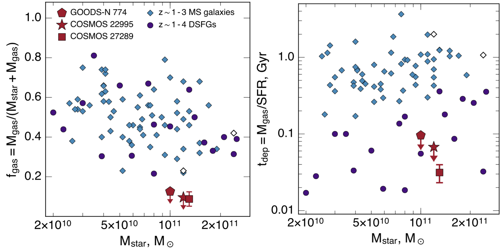

Spilker et al. (2016), ApJ, 832, 19
====================================

[ADS](https://ui.adsabs.harvard.edu/abs/2016ApJ...832...19S/abstract) | [arXiv](https://arxiv.org/abs/1607.01785)

My first non-SPT paper, that spawned out of a desire to get to use the VLA for
something (anything!), because then I would feel like a "real" radio astronomer.
It turned out to be really interesting! Jodie Foster would be proud.

We subsequently followed up the galaxy we detected here with higher-resolution
VLA observations, published in 
[Spilker et al. 2019](https://ui.adsabs.harvard.edu/abs/2019ApJ...883...81S/abstract)

Provided here are the VLA CO(1-0) spectra from Figure 2 in the paper, as well as
the observational results in Table 2.

Citation
--------

    @ARTICLE{spilker16b,
           author = {{Spilker}, Justin S. and {Bezanson}, Rachel and {Marrone}, Daniel P. and
             {Weiner}, Benjamin J. and {Whitaker}, Katherine E. and
             {Williams}, Christina C.},
            title = "{Low Gas Fractions Connect Compact Star-forming Galaxies to Their z \raisebox{-0.5ex}\textasciitilde 2 Quiescent Descendants}",
          journal = {\apj},
         keywords = {galaxies: formation, galaxies: high-redshift, galaxies: ISM, Astrophysics - Astrophysics of Galaxies},
             year = 2016,
            month = nov,
           volume = {832},
           number = {1},
              eid = {19},
            pages = {19},
              doi = {10.3847/0004-637X/832/1/19},
    archivePrefix = {arXiv},
           eprint = {1607.01785},
     primaryClass = {astro-ph.GA},
           adsurl = {https://ui.adsabs.harvard.edu/abs/2016ApJ...832...19S},
          adsnote = {Provided by the SAO/NASA Astrophysics Data System}
    }

