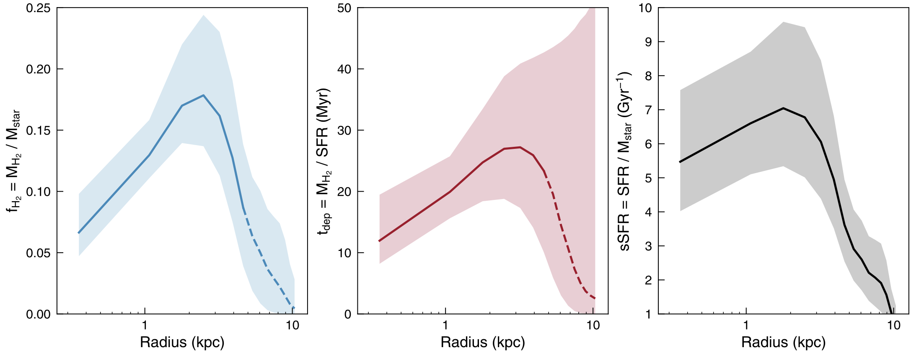

Spilker et al. (2019), ApJ, 883, 81
===================================

[ADS](https://ui.adsabs.harvard.edu/abs/2019ApJ...883...81S/abstract) | [arXiv](https://arxiv.org/abs/1908.02294)

This file contains the radial profiles for the z=2.3 compact galaxy COSMOS 27289, including
the profiles of Mstar (from HST F160W imaging), MH2 (from VLA CO(1-0)) and SFR (from ALMA 870um),
along with combinations of these to get profiles of sSFR = SFR/Mstar, fH2 = MH2/Mstar, and tdep = MH2/SFR.
These can be used to recreate Figures 4 and 5 in the paper (I can also provide the simulation profile
from Figure 6 on request).

The uncertainties come from Monte Carlo resampling the profiles within the uncertainties and
recalculating the profiles. The uncertainties are asymmetric, so there are three columns per value
in the above, one that gives the median (50th percentile) of the trials, and two uncertainties, where
the `_m` and `_p` subscripts give the lower (15.17th percentile) and upper (84.13th percentile) 
bounds on the uncertainty (i.e. the 1sigma / 68percent interval), respectively. So for example, 
to reproduce Figure 5 in the paper (shown above), you would plot the `fH2` curve as a line, and 
then fill between the values for `fH2_m` and `fH2_p`, which trace out the lower and
upper edges of the blue shaded region in the image above.

Citation
--------

    @ARTICLE{2019ApJ...883...81S,
           author = {{Spilker}, Justin S. and {Bezanson}, Rachel and {Weiner}, Benjamin J. and
             {Whitaker}, Katherine E. and {Williams}, Christina C.},
            title = "{Evidence for Inside-out Galaxy Growth and Quenching of a z ̃ 2 Compact Galaxy From High-resolution Molecular Gas Imaging}",
          journal = {\apj},
         keywords = {Compact galaxies, Galaxy quenching, High-redshift galaxies, Molecular gas, Galaxy structure, Astrophysics - Astrophysics of Galaxies},
             year = 2019,
            month = sep,
           volume = {883},
           number = {1},
              eid = {81},
            pages = {81},
              doi = {10.3847/1538-4357/ab3804},
    archivePrefix = {arXiv},
           eprint = {1908.02294},
     primaryClass = {astro-ph.GA},
           adsurl = {https://ui.adsabs.harvard.edu/abs/2019ApJ...883...81S},
          adsnote = {Provided by the SAO/NASA Astrophysics Data System}
    }